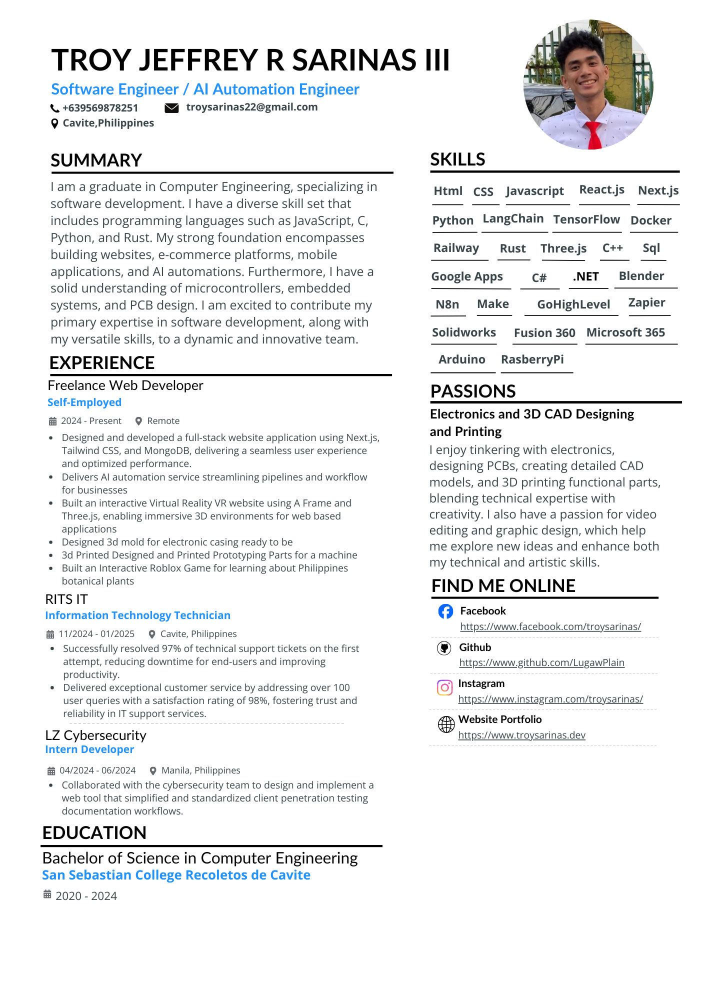

# Troy Sarinas - Personal Portfolio

A modern, responsive personal portfolio website built with Next.js 15, showcasing my skills, experience, and projects as an AI Automation & Full Stack Engineer.

## 🚀 Live Demo

Visit the live portfolio: [https://www.troysarinas.dev](https://www.troysarinas.dev)

## 📋 About

This portfolio represents Troy Sarinas - a Computer Engineering graduate passionate about technology and design. The website showcases his expertise in AI automation, full-stack development, and his collaborative work with companies worldwide to create visually stunning, highly functional digital experiences.

## ✨ Features

### 🎨 Modern Design

- **Responsive Design**: Optimized for all devices and screen sizes
- **Interactive Animations**: Smooth transitions and hover effects using Framer Motion
- **Custom Cursor Effects**: Interactive cursor with particle effects
- **3D Elements**: Spline 3D animations and interactive components
- **Lottie Animations**: Engaging animated illustrations throughout the site

### 🛠️ Technical Features

- **Next.js 15**: Latest React framework with App Router
- **TypeScript**: Type-safe development
- **Tailwind CSS 4**: Modern utility-first CSS framework
- **Radix UI**: Accessible component primitives
- **Framer Motion**: Advanced animations and interactions
- **Spline**: 3D design integration
- **Responsive Navigation**: Mobile-friendly hamburger menu
- **Smooth Scrolling**: Enhanced user experience

### 📱 Sections

- **Hero Section**: Introduction with animated avatar and status indicators
- **Projects**: Showcase of featured projects with live demos
- **Experience**: Professional work history with company highlights
- **Education**: Academic background and achievements
- **Technologies**: Interactive skills showcase with proficiency levels
- **Resume**: Downloadable PDF and full-size view
- **Contact**: Social links and contact information
- **AI Chat**: Interactive chat widget with AI assistant

## 🛠️ Tech Stack

### Frontend

- **Framework**: Next.js 15.5.4
- **Language**: TypeScript
- **Styling**: Tailwind CSS 4
- **UI Components**: Radix UI
- **Animations**: Framer Motion
- **3D Graphics**: Spline, Three.js
- **Icons**: React Icons, Lucide React

### Development Tools

- **Package Manager**: npm
- **Linting**: ESLint
- **Build Tool**: Turbopack
- **Fonts**: Google Fonts (Inter, Fraunces, Montserrat, Geist)

### Integrations

- **Analytics**: GitHub Stars integration
- **Social**: Social media links
- **Payments**: Buy Me a Coffee integration
- **AI Chat**: Interactive AI assistant with session management
- **Hosting**: Vercel (optimized for Next.js)

## 📱 Responsive Design

The portfolio is fully responsive and optimized for:

- **Desktop**: Full feature experience with hover effects
- **Tablet**: Adapted layouts with touch-friendly interactions
- **Mobile**: Collapsible navigation and optimized touch targets

## 🤖 AI Chat Functionality

The portfolio includes an interactive AI chat widget that allows visitors to engage with an AI assistant. The chat system provides:

### Features

- **Real-time Conversations**: Interactive chat interface with typing indicators
- **Session Management**: Persistent chat sessions with localStorage
- **Rate Limiting**: Message cooldown and session limits for optimal performance
- **Health Monitoring**: Real-time status checking of the AI service
- **Accessibility**: Keyboard navigation and screen reader support

### Usage

- Click the chat button in the bottom-right corner
- Choose from predefined questions or type your own
- Engage in conversation with the AI assistant
- Restart conversation anytime with the "Restart" button

## 🤝 Contributing

While this is a personal portfolio, suggestions and improvements are welcome! Feel free to:

- Report bugs
- Suggest new features
- Submit pull requests

## 📞 Contact

Troy Sarinas

- 📧 Email: troysarinas22@gmail.com
- 📱 Phone: +639569878251
- 🌐 Portfolio: [troysarinas.vercel.app](https://www.troysarinas.dev)
- 💼 LinkedIn: [Troy Sarinas](https://www.linkedin.com/in/troy-sarinas-47062b1ba/)
- 🐙 GitHub: [@LugawPlain](https://github.com/LugawPlain)

---

**Built with ❤️ using Next.js, TypeScript, and Tailwind CSS**
